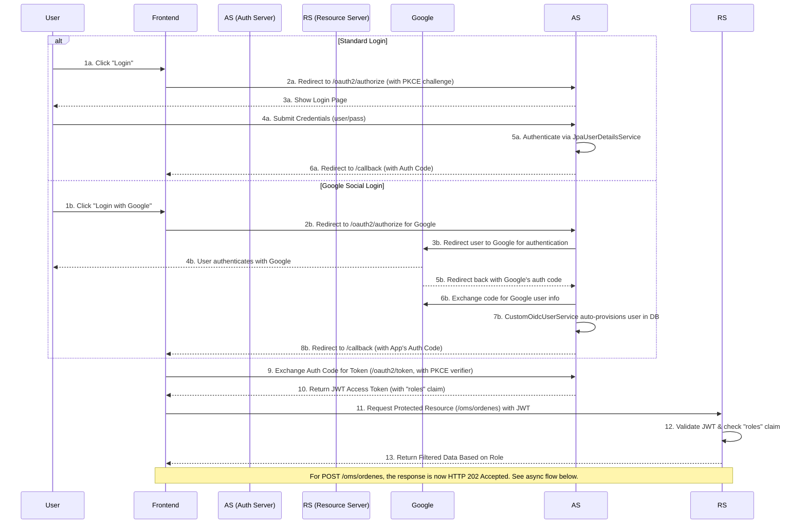
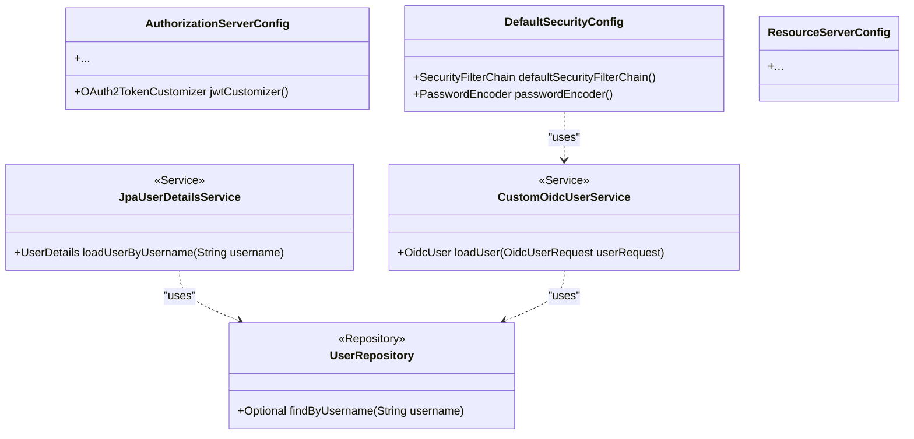
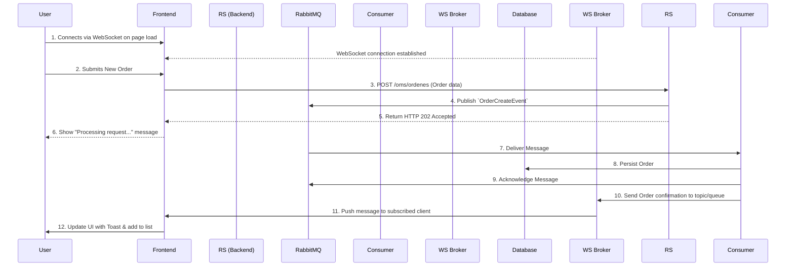

# Pizza Management Dashboard - Technical Documentation

## 1. Overview

This document provides a comprehensive technical overview of the Pizza Management Dashboard, a full-stack application featuring a Java backend (powered by Spring Boot and Spring Security) and a React frontend. The focus of this documentation is on the security architecture, system design, and operational procedures.

### 1.1. Technology Stack

- **Backend:**
  - Java 21
  - Spring Boot 3.3.0
  - Spring Security (OAuth2 Authorization Server, Resource Server, OAuth2 Client)
  - Spring Data JPA
- **Frontend:**
  - React (Vite)
  - TypeScript
  - Tailwind CSS
- **Database:**
  - PostgreSQL 16
  - Flyway (Schema Versioning)
- **Messaging:**
  - RabbitMQ 3.13
- **Testing:**
  - **Backend:** JUnit 5, Mockito, Testcontainers, REST Assured
  - **Frontend:** Vitest, React Testing Library

### 1.2. Project Structure

```
.
├── PizzaMDP/           # Spring Boot Backend
│   └── src/main/java/
│       └── com/pizzamdp/
│           ├── config/         # Security & App Configuration
│           ├── controllers/    # API Endpoints
│           ├── services/       # Business Logic
│           ├── entities/       # JPA Entities
│           └── repositories/   # Data Access Layer
│
└── frontend/               # React Frontend
    └── src/
        ├── components/     # React Components
        ├── services/       # API integration
        └── App.tsx         # Main application component
```

## 2. Setup and Configuration

### 2.1. Prerequisites

- Docker
- Docker Compose

### 2.2. Running the Application

1.  **Clone the repository.**
2.  **Configure Google Social Login**:
    - Create OAuth 2.0 credentials in the Google Cloud Console.
    - Set the following environment variables. You can create a `.env` file in the root of the project:
      ```
      GOOGLE_CLIENT_ID=your-google-client-id
      GOOGLE_CLIENT_SECRET=your-google-client-secret
      ```
3.  **Build and run the application** using Docker Compose:
    ```bash
    sudo docker-compose up --build -d
    ```
4.  The **frontend** will be available at `http://localhost:5173`.
5.  The **backend API** will be available at `http://localhost:8080`.
6.  The **RabbitMQ Management UI** will be available at `http://localhost:15672` (user: `user`, pass: `password`).

### 2.3. Running the Automated Tests

#### Backend Tests

To run the backend test suite, navigate to the `PizzaMDP` directory and run:

```bash
mvn test
```

#### Frontend Tests

To run the frontend test suite, navigate to the `frontend` directory and run:

```bash
pnpm test
```

## 3. Security Architecture

The application is secured using **OAuth 2.0** and **OpenID Connect**, with a Spring Authorization Server and a Resource Server. It features a Role-Based Access Control (RBAC) system.

### 3.1. Role Model

| Role              | Permissions                                                                   | Description                                                                 | Authentication Method |
| ----------------- | ----------------------------------------------------------------------------- | --------------------------------------------------------------------------- | --------------------- |
| `ROLE_ADMINISTRADOR` | Full access to all API endpoints.                                             | Can manage the pizza catalog, stock, and view all orders.                   | Username / Password   |
| `ROLE_CLIENTE`      | Can create orders and view their own orders.                                  | A customer of the pizzeria. Users are auto-provisioned on first login.      | Google Social Login   |
| `ROLE_RIDER`        | Can view orders assigned to them.                                             | A delivery person. Users are created by an administrator.                   | Username / Password   |


### 3.2. Protected Endpoints

The primary endpoint `/oms/ordenes` now has role-based filtering:
- **`GET /oms/ordenes`**:
    - `ROLE_CLIENTE`: Returns only orders created by the authenticated user.
    - `ROLE_RIDER`: Returns only orders assigned to the authenticated user.
    - `ROLE_ADMINISTRADOR`: Returns all orders.
- **`POST /oms/ordenes`**:
    - `ROLE_CLIENTE`: Creates an order and automatically assigns it to the authenticated user.

## 4. System Design

### 4.1. Authentication and Authorization Flow (Sequence Diagram)

The application supports both a standard **Authorization Code Grant with PKCE** and a **Federated Social Login** flow.



### 4.2. Security Components (Class Diagram)



### 4.3. Full Asynchronous Flow with Real-Time Notification

The order creation process is fully asynchronous to ensure resilience and scalability. The frontend is notified of the final order status via WebSockets.



(Other sections remain the same)
...
