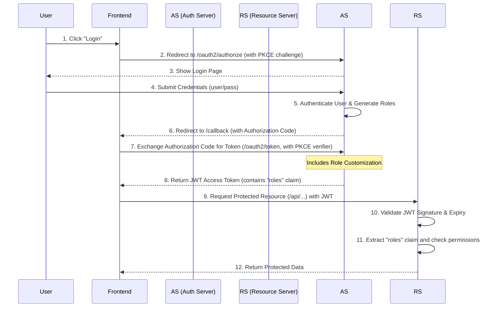
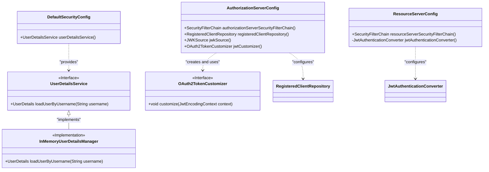
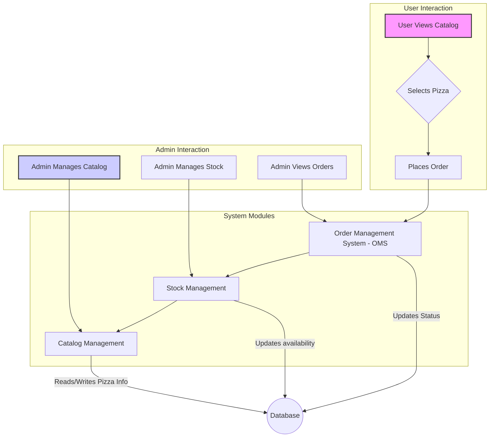

# Pizza Management Dashboard - Technical Documentation

## 1. Overview

This document provides a comprehensive technical overview of the Pizza Management Dashboard, a full-stack application featuring a Java backend (powered by Spring Boot and Spring Security) and a React frontend. The focus of this documentation is on the security architecture, system design, and operational procedures.

### 1.1. Technology Stack

- **Backend:**
  - Java 8
  - Spring Boot 2.7.5
  - Spring Security OAuth2 Authorization Server 0.4.0
  - Spring Data JPA
- **Frontend:**
  - React (Vite)
  - TypeScript
  - Tailwind CSS
- **Database:**
  - H2 In-Memory Database

### 1.2. Project Structure

```
.
├── PizzaMDP/           # Spring Boot Backend
│   └── src/main/java/
│       └── com/pizzamdp/
│           ├── config/         # Security (Auth Server, Resource Server)
│           ├── controllers/    # API Endpoints
│           ├── entities/       # JPA Entities
│           └── repositories/   # Data Access Layer
│
└── frontend/               # React Frontend
    └── src/
        ├── components/     # React Components
        ├── services/       # API integration
        └── App.tsx         # Main application component
```

## 2. Setup and Configuration

### 2.1. Prerequisites

- Docker
- Docker Compose

### 2.2. Environment Variables

The application is configured via environment variables. Create a `.env` file in the root directory with the following content:

```env
# The OAuth2 Client ID used by the frontend to identify itself to the Authorization Server.
# This value is shared with the frontend application.
SECURITY_OAUTH2_CLIENT_ID=pizza-client

# The allowed origin for CORS requests. This should be the URL of your frontend application.
ALLOWED_ORIGIN=http://localhost:5173
```

### 2.3. Running the Application

1.  **Clone the repository.**
2.  **Create the `.env` file** as described above.
3.  **Build and run the application** using Docker Compose:
    ```bash
    docker-compose up --build -d
    ```
4.  The **frontend** will be available at `http://localhost:5173`.
5.  The **backend API** will be available at `http://localhost:8080`.
6.  **API Documentation**: Note that this project does not include a Swagger/OpenAPI UI by default. API endpoints are documented within this README.

## 3. Security Architecture

The application is secured using **OAuth 2.0** and **OpenID Connect**, with a Spring Authorization Server and a Resource Server. It features a Role-Based Access Control (RBAC) system.

### 3.1. Role Model

| Role              | Permissions                                                                   | Description                                                                 |
| ----------------- | ----------------------------------------------------------------------------- | --------------------------------------------------------------------------- |
| `ROLE_ADMINISTRADOR` | Full access to all API endpoints.                                             | Can manage the pizza catalog, stock, and view all orders.                   |
| `ROLE_USUARIO`      | Limited access to order-related endpoints.                                    | Can place new orders and view the status of their own orders.               |

### 3.2. Protected Endpoints

| Endpoint                  | `ADMINISTRADOR` | `USUARIO` |
| ------------------------- | --------------- | --------- |
| `/oms/ordenes`            | ✅               | ✅         |
| `/oms/ordenes/status`     | ✅               | ✅         |
| `/oms/**`                 | ✅               | ❌         |
| `/catalogo/**`            | ✅               | ❌         |
| `/stock/**`               | ✅               | ❌         |

### 3.3. Test Users

| Username | Password   | Role              |
| -------- | ---------- | ----------------- |
| `admin`  | `password` | `ADMINISTRADOR`   |
| `user`   | `password` | `USUARIO`         |

## 4. System Design

### 4.1. Authentication and Authorization Flow (Sequence Diagram)

The application uses the **OAuth 2.0 Authorization Code Grant with PKCE**.



### 4.2. Security Components (Class Diagram)



### 4.3. Functional Flowchart



## 5. Manual Testing

### 5.1. Obtaining an Access Token (Authorization Code Flow)

This process requires a tool like `curl` and a Base64 encoder.

1.  **Generate a PKCE Code Verifier and Challenge:**
    ```bash
    # (Use an online generator or a library for this in a real app)
    CODE_VERIFIER="your_random_pkce_verifier"
    CODE_CHALLENGE=$(echo -n $CODE_VERIFIER | shasum -a 256 | cut -d' ' -f1 | xxd -r -p | base64 | tr -d '\n' | sed 's/+/-/g; s/\//_/g; s/=//g')
    ```

2.  **Get an Authorization Code:**
    Construct this URL and open it in a browser. Log in as `user` or `admin`.
    ```
    http://localhost:8080/oauth2/authorize?response_type=code&client_id=pizza-client&scope=openid%20pizza.read&redirect_uri=http://localhost:5173/callback&code_challenge=$CODE_CHALLENGE&code_challenge_method=S256
    ```
    After logging in, you will be redirected to a URL like `http://localhost:5173/callback?code=YOUR_CODE`. Copy `YOUR_CODE`.

3.  **Exchange the Code for a Token:**
    ```bash
    curl --location --request POST 'http://localhost:8080/oauth2/token' \
    --header 'Content-Type: application/x-www-form-urlencoded' \
    --data-urlencode 'grant_type=authorization_code' \
    --data-urlencode 'code=YOUR_AUTHORIZATION_CODE' \
    --data-urlencode 'redirect_uri=http://localhost:5173/callback' \
    --data-urlencode 'client_id=pizza-client' \
    --data-urlencode "code_verifier=$CODE_VERIFIER"
    ```

### 5.2. Decoding the JWT

The response will contain an `access_token`. You can decode it using a tool like [jwt.io](https://jwt.io) to inspect its payload and verify the `roles` claim.

**Example Payload:**
```json
{
  "sub": "admin",
  "aud": "pizza-client",
  "nbf": 1672531200,
  "scope": [
    "openid",
    "pizza.read"
  ],
  "roles": [
    "ADMINISTRADOR"
  ],
  "iss": "http://localhost:8080",
  "exp": 1672534800,
  "iat": 1672531200
}
```

## 6. Application Edge Cases

This matrix outlines how the system responds to various security and functional edge cases.

| Category      | # | Edge Case Scenario                                      | Action Triggering the Case                                     | Expected System Response                                               | HTTP Status Code   |
|---------------|---|---------------------------------------------------------|----------------------------------------------------------------|------------------------------------------------------------------------|--------------------|
| **Security**  | 1 | **Invalid Token**                                       | API request with a malformed or invalid JWT.                   | The Resource Server rejects the request.                               | `401 Unauthorized` |
|               | 2 | **Expired Token**                                       | API request with a valid but expired JWT.                      | The Resource Server rejects the request.                               | `401 Unauthorized` |
|               | 3 | **Insufficient Permissions**                            | A user with `ROLE_USUARIO` attempts to access `/catalogo`.     | The Resource Server denies access due to role mismatch.                | `403 Forbidden`    |
|               | 4 | **No Token Provided**                                   | API request to a protected endpoint without `Authorization`.   | The Resource Server rejects the request.                               | `401 Unauthorized` |
|               | 5 | **Incorrect PKCE Verifier**                             | Token exchange request with an incorrect `code_verifier`.      | The Authorization Server rejects the exchange.                         | `400 Bad Request`  |
| **Catalog**   | 6 | **Resource Not Found**                                  | `GET` request for a resource with a non-existent ID (e.g., `/catalogo/variedad/999`). | The server cannot find the requested resource.                         | `404 Not Found`    |
|               | 7 | **Invalid Input Data**                                  | `POST` request to create a pizza variety with an empty name.   | The server validates the input and rejects it due to missing data.     | `400 Bad Request`  |
|               | 8 | **Duplicate Resource Creation**                         | `POST` request to create a pizza variety with a name that already exists. | The server identifies a conflict with existing data.                   | `409 Conflict`     |
| **Orders (OMS)** | 9 | **Order for Non-existent Item**                         | `POST` request to `/oms/ordenes` for a pizza variety ID that does not exist. | The system cannot process the order because the item is not in the catalog. | `400 Bad Request`  |
|               | 10| **Order for Out-of-Stock Item**                         | `POST` request to `/oms/ordenes` for an item with zero stock. | The system cannot fulfill the order due to lack of stock.              | `409 Conflict`     |
|               | 11| **Check Status of Non-existent Order**                  | `GET` request to `/oms/ordenes/status` with an invalid order ID. | The server cannot find the requested order.                            | `404 Not Found`    |
| **Stock**     | 12| **Update Stock for Non-existent Item**                  | `PUT` request to `/stock` for a pizza variety ID that does not exist. | The server cannot find the item to update its stock.                   | `404 Not Found`    |
|               | 13| **Set Negative Stock**                                  | `PUT` request to `/stock` with a negative value.               | The server validates the input and rejects the negative value.         | `400 Bad Request`  |

## 7. Troubleshooting

### 7.1. Port 8080 already in use

- **Issue:** `docker-compose up` fails with an error indicating that port 8080 is already allocated.
- **Solution:** Another service on your machine is using port 8080. You can either stop the conflicting service or change the port mapping in the `docker-compose.yml` file.
  ```yaml
  # In docker-compose.yml
  services:
    backend:
      ports:
        - "8081:8080" # Exposes the backend on port 8081 of the host
  ```

### 7.2. CORS Policy Error

- **Issue:** The frontend fails to connect to the backend API, and the browser console shows a Cross-Origin Resource Sharing (CORS) error.
- **Solution:** This usually means the `ALLOWED_ORIGIN` environment variable is not correctly configured.
  1.  Ensure you have a `.env` file in the project root.
  2.  Verify that the `ALLOWED_ORIGIN` value in the `.env` file matches the URL of the frontend (by default, `http://localhost:5173`).
  3.  Rebuild and restart the Docker containers: `docker-compose up --build -d`.
