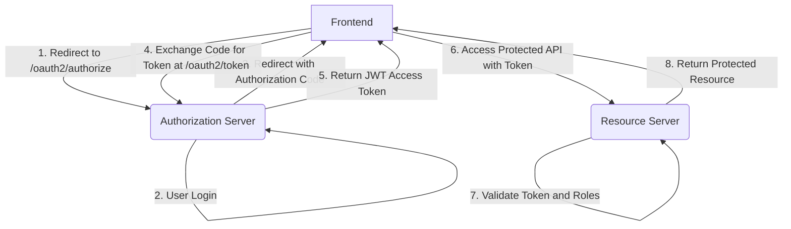

# Pizza Management Dashboard

This is a full-stack application that allows users to manage pizzas. It consists of a Java backend powered by Spring Boot and Spring Security, and a React frontend built with Vite.

## Project Structure

- `PizzaMDP/`: The Java backend.
- `frontend/`: The React frontend.
- `docker-compose.yml`: Docker Compose file for running the application.

## Getting Started

### Prerequisites

- Docker
- Docker Compose

### Running the Application

1. Clone the repository.
2. Run `docker-compose up --build` to build and start the application.
3. The frontend will be available at `http://localhost:5173`.
4. The backend API will be available at `http://localhost:8080`.

## Security Configuration

The application is secured using OAuth 2.0 and OpenID Connect, with a Spring Authorization Server and a Resource Server. It features a Role-Based Access Control (RBAC) system with two predefined roles:

- **`ADMINISTRADOR`**: Full access to all API endpoints.
- **`USUARIO`**: Limited access to specific endpoints.

### Test Users

- **Username**: `admin`, **Password**: `password`, **Role**: `ADMINISTRADOR`
- **Username**: `user`, **Password**: `password`, **Role**: `USUARIO`

### Protected Endpoints

| Endpoint                  | `ADMINISTRADOR` | `USUARIO` |
| ------------------------- | --------------- | --------- |
| `/oms/ordenes`            | ✅               | ✅         |
| `/oms/ordenes/status`     | ✅               | ✅         |
| `/oms/**`                 | ✅               | ❌         |
| `/catalogo/**`            | ✅               | ❌         |
| `/stock/**`               | ✅               | ❌         |
| `/api/me`                 | ✅               | ✅         |

### Authentication Flow

The application uses the OAuth 2.0 Authorization Code Grant with PKCE.



## API Usage

### GET /api/me

Returns information about the authenticated user, including their username and roles.

**Example Request:**

```bash
curl -H "Authorization: Bearer <YOUR_ACCESS_TOKEN>" http://localhost:8080/api/me
```

**Example Response:**

```json
{
  "username": "admin",
  "roles": ["ADMINISTRADOR"]
}
```

### Other Endpoints

All other API endpoints under `/api/**` are protected and require a valid JWT access token.
